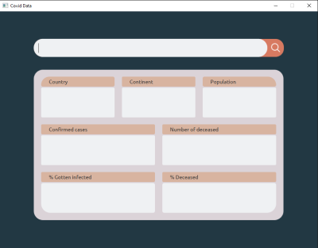
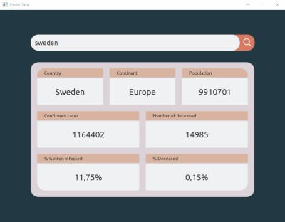
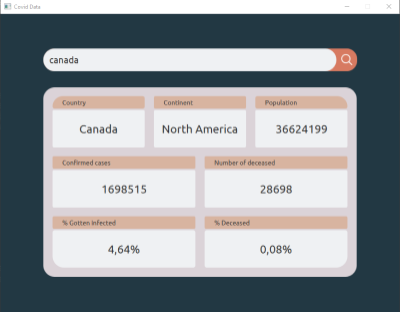
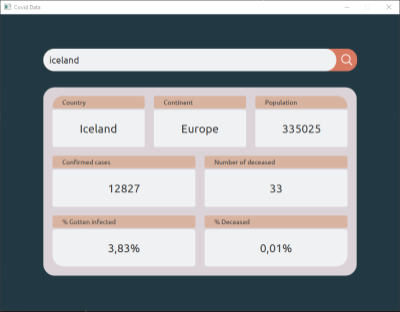

# CovidData

Application that lets you search for a country and shows you some relevant data concerning Covid-19 cases. 

The project was made with JavaFX, and it uses "https://covid-api.mmediagroup.fr/v1/cases" API.

Below you can see what data gets displayed and how the application looks.

